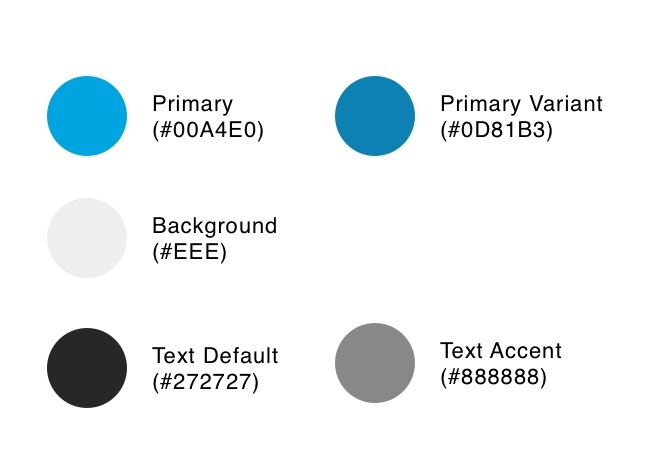

# JUNIQE frontend application

## Welcome

Thank you for your application! To test the practical skills of our applicants, we ask each applicant to complete the following task.

Please use a JavaScript framework for the implementation of the task. Since we use Nuxt.js and Vue.js ourselves, we would prefer these, but any other modern JavaScript framework is also fine. The use of TypeScript is optional. Furthermore we would ask you not to use any CSS framework (like Bootstrap or TailwindCSS) and to make sure that semantic HTML is used.

The task is designed to be completed in about 3 hours. Please still take enough time to achieve your best possible result.

To submit your task, please create a private GitHub repository and invite [JennyZeiser](https://github.com/JennyZeiser) und [hoersamu](https://github.com/hoersamu).

## Task
This task is about implementing a responsive card layout, where the cards can be filtered and sorted.

The data for the cards can be queried via an API provided by us.

Please implement the supplied design and the described functionalities. Please also ensure to test the application sufficiently.

### Part 1 - Implementing design

In the directory `mockups` you will find the layouts to be implemented:

The list of cards should be implemented responsively, with the maximum width of the content area being 920px and the minimum 320px.

At each breakpoint, the available space should be used optimally. This also means that the cards can change size within a breakpoint.

The overall layout consists of a header with heading, a toolbar and a list of cards.

The toolbar includes a search field, a filter dropdown, and a checkbox.

The card layout consists of the following elements:

- Cover image
- Author avatar (blue circle with author's initials)
- Name of the author
- Creation date of the article
- Title of the article
- Like button, which changes styling depending on the state (see `active-states.jpg`)
- Number of likes

Please use the following color scheme for the conversion, this is also included in the file `color-scheme.jpg`.

The data for the cards can be retrieved via the endpoint `https://myposter.de/web-api/job-interview`. A specification of the API interface can be found in the file `api.json`.

**Notes:**

- The icons to use can be found in the directory `assets`.
- In the designs the font `AvenirNext` is used, because it is proprietary, please use another one

### Part 2 - Implementing functionality

Please implement the features described below.

**App features**

The user should be able to search for authors and titles using the search function. Only the filtered cards should be displayed.

Posts should still be sortable by author name (alphabetically) or date (ascending and descending) via a dropdown.

If the checkbox is activated, only posts from the current year should be displayed.

**Card features**

Via a button, the user should be able to like/dislike the post. Depending on the state of the button, the styling (see `active-states.jpg`), as well as the number of likes changes.

### Part 3 - Writing tests
Please write meaningful tests for your application.